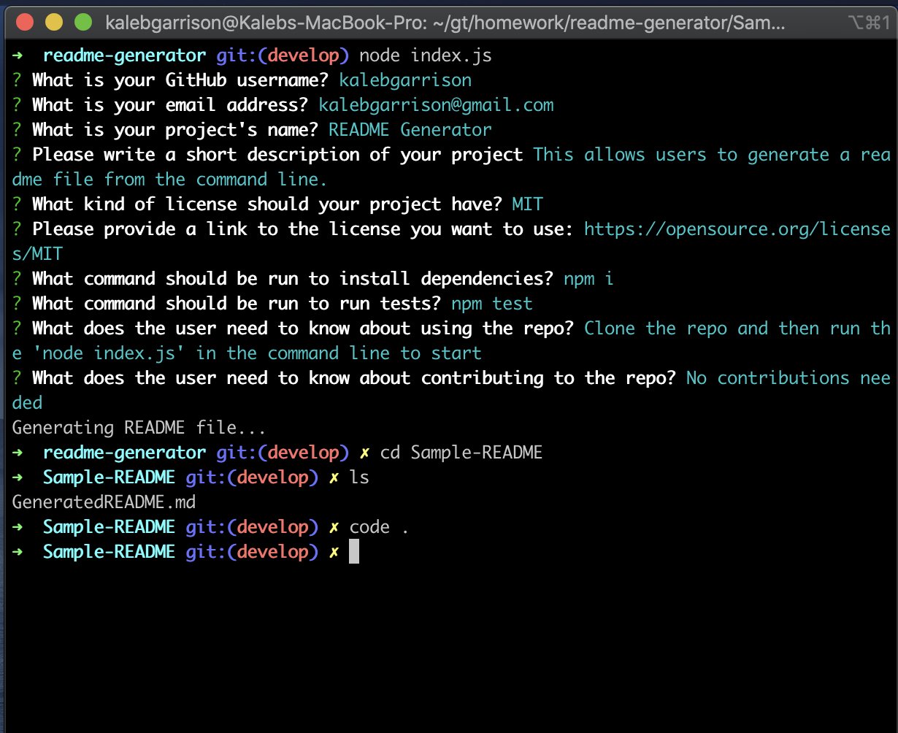
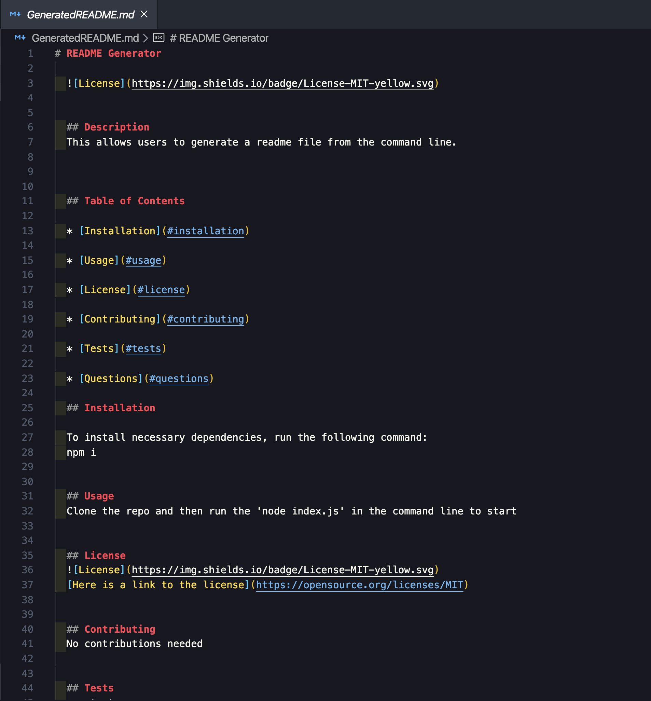

# readme-generator

## Description 
This is a command line that I wrote using Node.js. This material is designed to meet the standards set by the GT Full-stack program homework requirements. It is built using the languages mentioned and customized based on mockups in class. 

Any feedback can be provided via email at [kalebgarrison@gmail.com](mailto:kalebgarrison@gmail.com).

## Table of Contents 

* [Installation](#installation)
* [Usage](#usage)
* [License](#license)

## Installation

1. Clone the repo on github. 
2. Open the index.js file. 
3. Then run the command 'node index.js' in the command line. 
## Usage 

[Video of me running the command line](https://drive.google.com/file/d/1SVmSRuuYb2u41Fft0TK1QVPcDKFcbBwF/view)

[GitHub Repo Site](https://github.com/kalebgarrison/readme-generator)

 

## License

MIT License

Copyright (c) [2020] [KalebGarrison]

Permission is hereby granted, free of charge, to any person obtaining a copy
of this software and associated documentation files (the "Software"), to deal
in the Software without restriction, including without limitation the rights
to use, copy, modify, merge, publish, distribute, sublicense, and/or sell
copies of the Software, and to permit persons to whom the Software is
furnished to do so, subject to the following conditions:

The above copyright notice and this permission notice shall be included in all
copies or substantial portions of the Software.

THE SOFTWARE IS PROVIDED "AS IS", WITHOUT WARRANTY OF ANY KIND, EXPRESS OR
IMPLIED, INCLUDING BUT NOT LIMITED TO THE WARRANTIES OF MERCHANTABILITY,
FITNESS FOR A PARTICULAR PURPOSE AND NONINFRINGEMENT. IN NO EVENT SHALL THE
AUTHORS OR COPYRIGHT HOLDERS BE LIABLE FOR ANY CLAIM, DAMAGES OR OTHER
LIABILITY, WHETHER IN AN ACTION OF CONTRACT, TORT OR OTHERWISE, ARISING FROM,
OUT OF OR IN CONNECTION WITH THE SOFTWARE OR THE USE OR OTHER DEALINGS IN THE
SOFTWARE. [MIT License](https://choosealicense.com/licenses/mit/#)

---

## Badges

